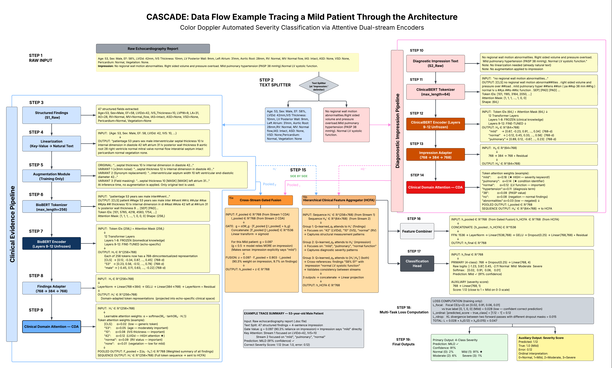

<p align="center">
  
</p>

<h1 align="center">CASCADE</h1>
<h3 align="center">Color Doppler Automated Severity Classification via Attentive Dual-stream Encoders</h3>

<p align="center">
  <a href="#"></a>
  <a href="#"></a>
  <a href="#"></a>
  <a href="LICENSE"></a>
  <a href="#"></a>
</p>

<p align="center">
  <a href="#overview">Overview</a> •
  <a href="#architecture">Architecture</a> •
  <a href="#results">Results</a> •
  <a href="#installation">Installation</a> •
  <a href="#usage">Usage</a> •
  <a href="#repository-structure">Structure</a> •
  <a href="#citation">Citation</a>
</p>

---

## Overview

**CASCADE** is a privacy-conscious, dual-stream transformer framework for automated **four-class severity classification** (Normal, Mild, Moderate, Severe) from de-identified Color Doppler Echocardiography (CDE) text reports.

Unlike traditional approaches that process clinical reports as monolithic text sequences, CASCADE explicitly separates **structured clinical findings** from **clinician-written diagnostic impressions** and learns their complementary contributions through attention-based fusion. The framework also includes a complete preprocessing pipeline for converting raw retrospective reports into de-identified, model-ready datasets.

### Key Contributions

- **Privacy-aware preprocessing pipeline** — Document parsing, GPT-4.1-based structured extraction of 48 clinical fields, HIPAA-compliant de-identification, reverse-engineering validation (96–99% field-level accuracy), and severity label construction across 11 cardiac disease categories.
- **Dual-stream architecture** — BioBERT encodes structured findings; ClinicalBERT encodes diagnostic impressions. Each stream uses selective layer unfreezing, bottleneck adapters, and Clinical Domain Attention (CDA).
- **Attention-based fusion** — Cross-Stream Gated Fusion dynamically weights stream contributions, while a Hierarchical Clinical Feature Aggregator (HCFA) captures cross-stream interactions via 3-group multihead attention.
- **Rigorous evaluation** — 3×5 repeated stratified k-fold cross-validation with clinically relevant metrics (QWK, balanced accuracy, per-class F1), interpretability analysis (gate values, token attention), and paired statistical testing (McNemar's test, bootstrap CIs).
- **Findings-only augmentation** — A clinically motivated augmentation strategy that modifies only the structured findings stream, preserving the integrity of cardiologist-written impressions.

---

## Architecture

<p align="center">
  
</p>

CASCADE processes each echocardiography report through the following pipeline:

```
Raw CDE Report
     │
     ├── Text Splitter (delimiter: "Impression:")
     │       │                        │
     │   Stream 1                 Stream 2
     │   Structured Findings      Diagnostic Impression
     │       │                        │
     │   Linearization            Raw free-text
     │   (key-value → text)           │
     │       │                        │
     │   Augmentation                 │
     │   (training only)              │
     │       │                        │
     │   BioBERT Encoder          ClinicalBERT Encoder
     │   (Layers 9-12 unfrozen)   (Layers 9-12 unfrozen)
     │       │                        │
     │   Findings Adapter         Impression Adapter
     │   (768→384→768)            (768→384→768)
     │       │                        │
     │   Clinical Domain          Clinical Domain
     │   Attention (CDA)          Attention (CDA)
     │       │                        │
     │       └──────┬─────────────────┘
     │              │
     │    ┌─────────┴──────────┐
     │    │                    │
     │  Cross-Stream       Hierarchical Clinical
     │  Gated Fusion       Feature Aggregator (HCFA)
     │  g·F + (1-g)·I      3-group multihead attention
     │    │                    │
     │    └────────┬───────────┘
     │             │
     │      Feature Combiner
     │      [h_pooled ; h_HCFA] → FFN → 768-d
     │             │
     │    Multi-Task Classification Head
     │    ├── Primary: 4-class severity
     │    └── Auxiliary: continuous severity score
     │
     ▼
  Severity Prediction: Normal | Mild | Moderate | Severe
```

---

## Results

### Main Performance (3×5 Repeated Stratified K-Fold, N=718)

| Model | F1 Macro | QWK | Bal. Acc | Severe F1 |
|:------|:--------:|:---:|:-------:|:---------:|
| TF-IDF + GBM (findings only) | 0.7243 | 0.7071 | 0.7130 | 0.6885 |
| TF-IDF + RF (full report) | 0.8116 | 0.8049 | 0.7976 | 0.8021 |
| TF-IDF + LogReg (full report) | 0.8354 | 0.8525 | 0.8424 | 0.8325 |
| TF-IDF + XGBoost (full report) | 0.8675 | 0.8562 | 0.8627 | 0.8592 |
| TF-IDF + GBM (full report) | 0.8908 | 0.8870 | 0.8933 | 0.8951 |
| BioBERT (full, single-stream) | 0.9292 ± 0.025 | 0.9379 ± 0.033 | 0.9293 ± 0.028 | 0.9068 ± 0.061 |
| **CASCADE (ours)** | **0.9442 ± 0.017** | **0.9584 ± 0.013** | **0.9486 ± 0.015** | **0.9272** |

### Key Findings

- **CASCADE outperforms all baselines** across every metric, achieving the highest F1 Macro (0.9442), QWK (0.9584), and Balanced Accuracy (0.9486).
- **Dual-stream design matters:** CASCADE improves over the single-stream BioBERT baseline (ΔF1 = +0.015, ΔQWK = +0.021) despite using the same BioBERT encoder, confirming the architectural contribution beyond just using transformers.
- **Lower variance:** CASCADE shows more stable predictions across folds (F1 std = 0.017 vs. 0.025 for single-stream BioBERT).
- **Statistical significance:** McNemar's test (χ² = 50.70, p < 0.000001) and bootstrap 95% CI [0.068, 0.117] confirm significant improvement over baselines.

### Aggregate Confusion Matrix

|  | Pred Normal | Pred Mild | Pred Moderate | Pred Severe |
|:---|:---:|:---:|:---:|:---:|
| **True Normal** | **98.8%** | 0.8 | 0.4 | 0.0 |
| **True Mild** | 0.2 | **94.4%** | 4.7 | 0.6 |
| **True Moderate** | 0.8 | 5.0 | **90.9%** | 3.3 |
| **True Severe** | 0.0 | 0.8 | 3.8 | **95.4%** |

### Gate Value Analysis

The learned gate values show CASCADE dynamically adjusts its reliance on each stream:

| Severity Class | Gate Value (mean ± std) | Interpretation |
|:---|:---:|:---|
| Normal | 0.406 ± 0.163 | Slight impression preference |
| Mild | 0.369 ± 0.202 | Stronger impression reliance |
| Moderate | 0.365 ± 0.212 | Strongest impression reliance |
| Severe | 0.423 ± 0.172 | More balanced; structured findings informative |

*Gate → 1.0 = relies on findings; Gate → 0.0 = relies on impression*

---

## Dataset

The dataset consists of **718 de-identified** Color Doppler Echocardiography reports from routine clinical practice. Due to institutional, ethical, and privacy restrictions, the raw data cannot be publicly released.

**Class Distribution:**

| Severity | Count | Percentage |
|:---------|:-----:|:----------:|
| Mild | 269 | 37.5% |
| Moderate | 205 | 28.6% |
| Normal | 165 | 23.0% |
| Severe | 79 | 11.0% |

Each report contains 48 structured clinical fields across 5 categories: demographics, M-mode/2-D measurements, structural/chamber findings, valve descriptions and Doppler findings, and diagnostic impression.

---

## Installation

### Prerequisites

- Python 3.10+
- NVIDIA GPU with CUDA support (tested on A100 40GB)
- ~16GB GPU memory recommended

### Setup

```bash
# Clone the repository
git clone https://github.com/YOUR_USERNAME/CASCADE.git
cd CASCADE

# Create virtual environment
python -m venv cascade_env
source cascade_env/bin/activate   # Linux/Mac
# cascade_env\Scripts\activate    # Windows

# Install dependencies
pip install -r requirements.txt
```

### Dependencies

```txt
torch>=2.0.0
transformers>=4.40.0
datasets>=2.0.0
evaluate>=0.4.0
accelerate>=0.20.0
scikit-learn>=1.3.0
scipy>=1.10.0
pandas>=2.0.0
numpy>=1.24.0
matplotlib>=3.7.0
seaborn>=0.12.0
openpyxl>=3.1.0
```

---

## Usage

### 1. CASCADE Model Training & Evaluation

The main CASCADE model with dual-stream architecture and 3×5 repeated stratified k-fold evaluation:

```bash
# Open in Google Colab or Jupyter
jupyter notebook notebooks/CASCADE_main.ipynb
```

**What it does:**
- Loads preprocessed echocardiography data
- Splits reports into findings and impression streams
- Trains the dual-stream CASCADE architecture
- Evaluates using 3×5 repeated stratified k-fold
- Generates all metrics, figures, and statistical tests

### 2. Single-Stream BioBERT Baseline

The ablation baseline using single-stream BioBERT on the full concatenated report:

```bash
jupyter notebook notebooks/BioBERT_SingleStream_3x5_KFold.ipynb
```

**What it does:**
- Fine-tunes BioBERT (`dmis-lab/biobert-base-cased-v1.2`) on full report text
- Uses the identical 3×5 repeated stratified k-fold protocol
- Computes all CASCADE-matching metrics (F1, QWK, Balanced Accuracy, etc.)
- Generates publication-quality comparison figures
- Outputs LaTeX-ready table rows

**Configuration — test different single-stream encoders:**
```python
# In the Config class, change MODEL_NAME:
MODEL_NAME = "dmis-lab/biobert-base-cased-v1.2"       # Same as CASCADE findings stream
MODEL_NAME = "emilyalsentzer/Bio_ClinicalBERT"         # Same as CASCADE impression stream
MODEL_NAME = "alvaroalon2/biobert_diseases_ner"         # NER-pretrained BioBERT
```

### 3. TF-IDF Baselines

Traditional machine learning baselines using TF-IDF features:

```bash
jupyter notebook notebooks/TF-IDF_Baselines.ipynb
```

### 4. Data Preprocessing Pipeline

The privacy-aware pipeline for converting raw `.doc` reports to model-ready datasets:

```bash
jupyter notebook notebooks/Data_Preprocessing_Pipeline.ipynb
```

**Pipeline stages:**
1. Raw report parsing (Word COM)
2. Structured extraction (GPT-4.1 via Azure OpenAI)
3. De-identification (HIPAA-compliant)
4. Reverse-engineering validation
5. Severity label construction

### 5. Interpretability Analysis

Gate value analysis, token attention visualization, and statistical testing:

```bash
jupyter notebook notebooks/Interpretability_Analysis.ipynb
```

---

## Repository Structure

```
CASCADE/
│
├── README.md                          # This file
├── LICENSE                            # MIT License
├── requirements.txt                   # Python dependencies
│
├── notebooks/
│   ├── CASCADE_main.ipynb             # Main CASCADE training & evaluation
│   ├── BioBERT_SingleStream_3x5_KFold.ipynb  # Single-stream ablation baseline
│   ├── TF-IDF_Baselines.ipynb         # TF-IDF baseline models
│   ├── Data_Preprocessing_Pipeline.ipynb  # Data construction pipeline
│   └── Interpretability_Analysis.ipynb    # Gate values, attention, stats
│
├── src/
│   ├── __init__.py
│   ├── cascade_model.py               # CASCADE architecture definition
│   ├── data_utils.py                  # Data loading and preprocessing
│   ├── training.py                    # Training loop and k-fold logic
│   ├── metrics.py                     # Evaluation metrics
│   ├── augmentation.py                # Findings-only augmentation
│   └── visualization.py              # Plotting and figure generation
│
├── configs/
│   └── cascade_config.yaml            # Hyperparameters and settings
│
├── results/
│   ├── fold_metrics/                  # Per-fold metrics CSV files
│   ├── figures/                       # Publication-quality figures
│   └── statistical_tests/             # McNemar's test, bootstrap CIs
│
└── assets/
    ├── cascade_banner.png             # Repository banner image
    ├── cascade_architecture.png       # Architecture diagram
    └── sample_report.png              # Sample CDE report visualization
```

---

## Training Configuration

| Parameter | Value |
|:----------|:------|
| Task | 4-class ordinal severity classification |
| Findings encoder | BioBERT (`dmis-lab/biobert-base-cased-v1.2`) |
| Impression encoder | ClinicalBERT (`emilyalsentzer/Bio_ClinicalBERT`) |
| Frozen layers | 1–8 (both encoders) |
| Unfrozen layers | 9–12 (both encoders) |
| Domain adapters | Bottleneck: 768 → 384 → 768 |
| Max sequence lengths | Findings: 256, Impression: 64 tokens |
| Loss function | Focal CE (γ=2) + Ordinal distance + R-Drop |
| Optimizer | AdamW |
| Learning rates | Encoders: 9×10⁻⁵, Head: 3×10⁻⁴ |
| Scheduler | CosineAnnealingWarmRestarts |
| Epochs | 40 per fold (early stopping, patience=7) |
| Batch size | 16 (effective 32 with gradient accumulation) |
| Precision | FP16 mixed precision |
| Hardware | NVIDIA A100 GPU (40GB) |
| Total parameters | 225.2M (65.3M trainable, 29%) |

---

## Reproducibility

To reproduce the main results:

1. **Data:** Due to privacy restrictions, the raw dataset is not publicly available. Contact the corresponding author for access (subject to institutional approval).
2. **Random seeds:** All experiments use `random_state=42` for `RepeatedStratifiedKFold` and model initialization.
3. **Evaluation protocol:** 3×5 repeated stratified k-fold (15 total evaluations) ensures robust performance estimation.
4. **Hardware:** Results reported were obtained on an NVIDIA A100 (40GB). Results may vary slightly on different GPU architectures due to floating-point non-determinism.

---

## Ethical Considerations

- All reports were **de-identified** before analysis in compliance with IRB approval and the Declaration of Helsinki.
- **HIPAA Safe Harbor** applied: ages above 89 normalized to "90+", all direct identifiers removed.
- Azure GPT-4.1 API used exclusively on de-identified data — no identifiable data transmitted to third parties.
- The framework is designed as a **decision-support tool**, not a replacement for clinical judgment.

---

## Citation

If you find this work useful, please cite our paper:

```bibtex
@article{shanto2025cascade,
  title={Transformer-based Language Model Fusion for Automated Severity Classification 
         of Color Doppler Echocardiography Reports},
  author={Shanto, Mohammad Naimul Islam and Uddin, Md Sayem and Ullah, Mohammad Aman 
          and Imran, Md. Ibrahim Al and Sayed, Md. Abu},
  journal={[Under Review]},
  year={2025}
}
```

---

## Acknowledgments

The authors acknowledge the clinical and technical support that made this retrospective study possible, and the physicians and staff involved in the generation and maintenance of the original echocardiography reports.

---

## License

This project is licensed under the MIT License — see the [LICENSE](LICENSE) file for details.

---

## Contact

- **Mohammad Naimul Islam Shanto** — [naimulislam11032@gmail.com](mailto:naimulislam11032@gmail.com) , [mshanto@students.kennesaw.edu](mailto:mshanto@students.kennesaw.edu)
- Kennesaw State University, Department of Computer Science
- International Islamic University Chittagong, Department of Computer Science and Engineering

---

<p align="center">
  <i>CASCADE: Bridging the gap between clinical report structure and automated severity classification.</i>
</p>
